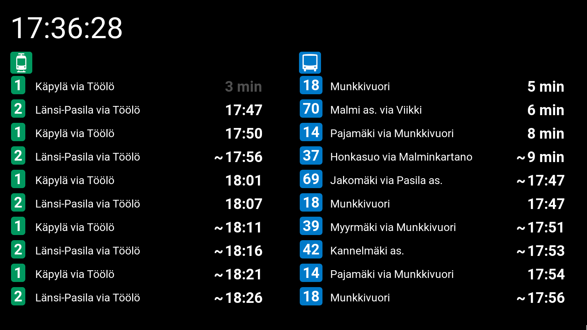

# Transit display

A [Flask](http://flask.pocoo.org/) app showing selected transit departures requested regularly from [Digitransit](https://digitransit.fi/en/developers) API.

Python 3.X as well as Flask need to be installed. To run the app using localhost, follow the instructions of [Flask by Example](https://realpython.com/flask-by-example-part-1-project-setup/) tutorial.

GraphQL request body to be sent to Digitransit API is defined in the beginning of `app.py` in dictionary named `conf`: you should pay attention to `stops(ids: [...])` and `numberOfDepartures` if you want to change the contents. Other body parameters are needed by further functions just as they are and should not be changed. `conf["start_offset"]` defines in seconds how close departures we don't want to request anymore: it might not be reasonable to show departures you can't reach due to 3-4 minutes walk anyway. `conf["max_departures_to_show"]` determines the amount of rows to which the displayed response is truncated, and you should adjust this so that all the rows fit into your screen. `conf["near_limit"]` defines time limit in minutes within which departure times are shown as "minutes left" instead of "HH:MM". `conf["about_to_depart"]` defines time limit in minutes within which minutes left will blink as the vehicle is just about to depart.

In the current version, `BUS` and `TRAM` are the only assumed modes. The departures are divided into two spans accordingly. **TODO**: It is planned to have departures of all modes shown together sorted by departure time. **TODO**: Transit mode icons and space reserved for stop location descriptions seem to be useless if there is a narrow and well-known selection of stops and modes are represented in route name background colors – remove these from the layout.

Request is made and departures are refreshed every minute: this behavior is defined in `static/scripts.js`.

## Known issues / to be fixed soon
- Departure times around midnight are not handled coherently and behave oddly: they do not sort right and negative values are shown after string formatting. Digitransit uses time values beyond 86400 seconds (> 24 hours) with night departures, and these are currently taken into account but then mix up e.g. with small int values of early morning departures.
- On errors, nothing reasonable currently happens. If request fails or response has unexpected format, error text should be shown instead of old departure information left to display.
